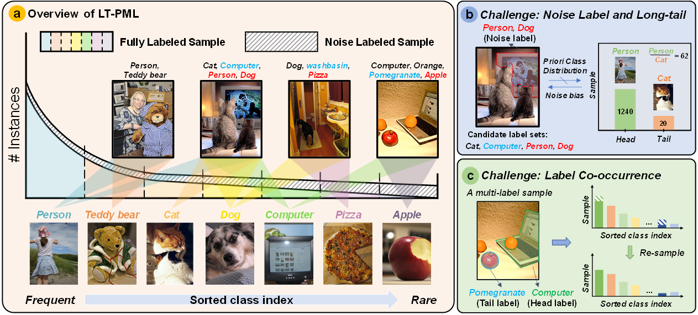
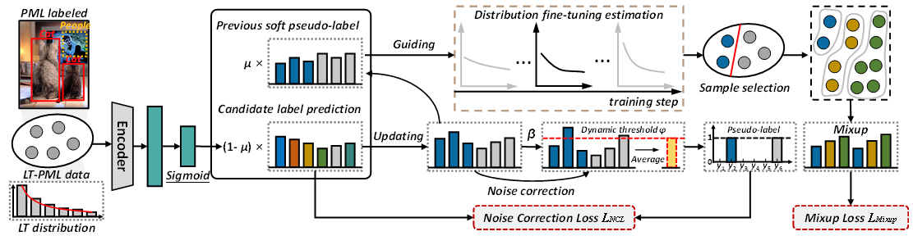

## NDLP--Noise Correction and Distribution Fine-Tuning for Long-Tailed Partial Multi-Label Learning

The article "Noise Correction and Distribution Fine-Tuning for Long-Tailed Partial Multi-Label Learning" has been accepted by **Pattern Recognition (PR 2026)**.


## :video_camera: Problem description of LT-PML
In this paper, we introduce a new and more realistic data setting for MLC, termed long-tailed partial multi-label learning (LT-PML), which simultaneously incorporates PML and LT distribution setups. As shown in Figure 1 (a), LT-PML presents two intertwined challenges: 1) Mutual hindrance between noisy annotations and LT distributions. The presence of candidate label sets prevent obtaining the class-wise label frequency priors, yet which is critical for existing LT methods. Moreover, the inherent LT distribution causes head classes to dominate training datasets, leading to under-learning of tail classes. This imbalance makes disambiguation of rare classes more challenging. Meanwhile, label ambiguity tends to disproportionately affect tail classes. In practice, when annotators are uncertain, they are more likely to assign ambiguous labels to infrequent classes, since these classes are less familiar and less visually distinctive (Figure 1 (b)). 2) Label co-occurrence. Label co-occurrence is common in natural images. As shown in Figure 1 (c), a rare label ``pomegranate`` may co-occur with a frequent label ``computer``. Naive resampling become ineffective. Oversampling this image to compensate for the rare class inevitably increases the exposure of the head class as well, thereby corrupting their learned representations.



## :scroll: Abstract 
Multi-label classifiers in practice often face two departures from standard benchmarks: labels are ambiguous and class frequencies are long-tailed. These conditions frequently co-occur, yielding long-tailed partial multi-label learning (LT-PML), where each sample is associated with a set of candidate labels, but only a subset of these labels is accurate. LT-PML is important because noisy candidate labels obscure reliable class-frequency priors required by long-tail learning, while the scarcity of tail samples makes label disambiguation more difficult. In addition, label co-occurrence biases resampling and distribution estimation. Therefore, we propose a noise correction and distribution fine-tuning framework for LT-PML (NDLP). First, NDLP maintains moving-averaged soft pseudo-labels to estimate both label confidence and class distribution, introduces class-aware noise correction to strengthen positive learning from likely true labels, and performs batch-wise distribution fine-tuning to alleviate estimation errors caused by co-occurrence. The results indicate that NDLP outperforms existing methods on LT-PML datasets.



## :closed_book: Requirements 
* [Pytorch](https://pytorch.org/)
* [Sklearn](https://scikit-learn.org/stable/)
## :clipboard: Dataset 
To evaluate/train Long-Tailed Partial Multi-Label Learning, first, the [VOC2012/2007](http://host.robots.ox.ac.uk/pascal/VOC/), [MSCOCO](https://cocodataset.org/#download) and [NUS-WIDE](https://huggingface.co/datasets/Lxyhaha/NUS-WIDE) datasets need to be downloaded. The image paths, labels, and captions for the VOC-MLT and COCO-MLT datasets can be found:

* [COCO-PMLT](https://github.com/zhongjingyu1/NDLP/tree/master/appendix)
* [VOC-PMLT](https://github.com/zhongjingyu1/NDLP/tree/master/appendix)
* [NW-PMLT](https://github.com/zhongjingyu1/NDLP/tree/master/appendix)
```
Shell
├── appendix
    ├── coco
        ├── coco_lt_train.txt
        ├── coco_lt_test.txt
        ├── coco_labels.txt
        ├── longtail2017
            ├── class_freq.pkl
            ├── class_split.pkl
    ├── VOCdevkit
        ├── voc_lt_train.txt
        ├── voc_lt_test.txt
        ├── voc_labels.txt
        ├── longtail2012
            ├── class_freq.pkl
            ├── class_split.pkl
    ├── nuswide
            ├── nw_lt_train.txt
            ├── nw_lt_test.txt
            ├── nw_labels.txt
            ├── class_freq.pkl
            ├── class_split.pkl
├── data
    ├── coco
        ├── train2017
            ├── 0000001.jpg
            ...
        ├── val2017
            ├── 0000002.jpg
            ...
    ├── voc
        ├── VOCdevkit
            ├── VOC2007
                ├── Annotations
                ├── ImageSets
                ├── JPEGImages
                    ├── 0000001.jpg
                    ...
                ├── SegementationClass
                ├── SegementationObject
            ├── VOC2012
                ├── Annotations
                ├── ImageSets
                ├── JPEGImages
                    ├── 0000002.jpg
                    ...
                ├── SegementationClass
                ├── SegementationObject
    ├── nuswide
        ├── images
            ├── 0_2124494179_b039ddccac_m.jpg
            ...
```
## :page_with_curl: Usage
### VOC-PMLT
```bash
python lmpt/train.py configs/voc/LT_resnet50_pfc_DB.py \
--dataset 'voc-lt' \
--seed '0' \
--batch_size 32 \
--epochs 10 \
--gamma 3
--partial_rate 0.3/0.5 \
--eta 0.9 \
--alpha_range 0.4,0.8 \
```
### COCO-PMLT or NW-PMLT
```bash
python lmpt/train.py configs/coco/LT_resnet50_pfc_DB.py \ 
--dataset 'voc-lt' \
--seed '0' \
--batch_size 32 \
--epochs 10 \
--gamma 2
--partial_rate 0.05/0.1 \
--eta 0.9 \
--alpha_range 0.4,0.8 \
```
## :wrench: Pre-trained models
#### COCO-MLT
|   Backbone  | $$\rho$$  |    Total   |    Head   |  Medium  |   Tail  |      Download      |
| :---------: |:---------:| :------------: | :-----------: | :---------: | :---------: | :----------------: |
|  ResNet-50  |    0.05   |    40.06   |    41.87  |  40.57   | 37.80   | [model](https://drive.google.com/drive/folders/1ju2zTv6pOuso8wBixN4RqLtszU8d8WDk?hl=zh-cn)   |
|  ResNet-50  |    0.1    |    35.21   |    40.65  |  32.83   | 33.55   | [model](https://drive.google.com/drive/folders/1ju2zTv6pOuso8wBixN4RqLtszU8d8WDk?hl=zh-cn)   |

#### VOC-MLT
|   Backbone  | $$\rho$$  |    Total   |    Head   |  Medium  |   Tail  |      Download      |
| :---------: |:---------:| :------------: | :-----------: | :---------: | :---------: | :----------------: |
|  ResNet-50  |    0.3    |    59.51   |    59.54  |  70.33   | 51.38   | [model](https://drive.google.com/drive/folders/1ju2zTv6pOuso8wBixN4RqLtszU8d8WDk?hl=zh-cn)   |
|  ResNet-50  |    0.5    |    40.76   |    43.09  |  52.59   | 30.13   | [model](https://drive.google.com/drive/folders/1ju2zTv6pOuso8wBixN4RqLtszU8d8WDk?hl=zh-cn)   |

#### NW-MLT
|   Backbone  | $$\rho$$  |    Total   |    Head   |  Medium  |   Tail  |      Download      |
| :---------: |:---------:| :------------: | :-----------: | :---------: | :---------: | :----------------: |
|  ResNet-50  |    0.05   |    29.43   |    33.04  |  23.31   | 51.78   | [model](https://drive.google.com/drive/folders/1ju2zTv6pOuso8wBixN4RqLtszU8d8WDk?hl=zh-cn)   |

## :heartpulse: Acknowledgements
We use code from [DBL](https://github.com/wutong16/DistributionBalancedLoss) and [LMPT](https://github.com/richard-peng-xia/LMPT). We thank the authors for releasing their code.
## :mailbox_closed: Contact
If you have any questions, please create an issue on this repository or contact at [23171214508@stu.xidian.edu.cn](mailto:23171214508@stu.xidian.edu.cn).
<!-- ## :pencil2: Citing
If you find this code useful, please consider to cite our work.
```
``` -->

