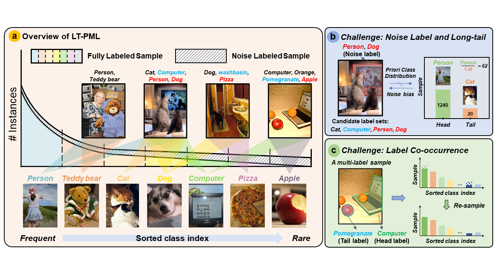
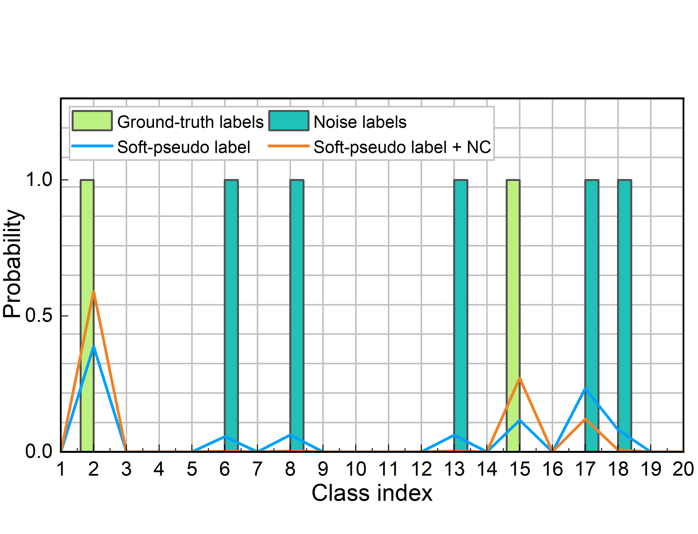

# Noise-Correction-and-Distribution-Fine-Tuning
#### Noise Correction and Distribution Fine-Tuning for Long-Tailed Partial Multi-Label Learning

  
  

## :video_camera: Problem description of LT-PML

(a) Summarize the proposed LT-PML task. (b) Describes the first key challenge of the LT-PML task: noisy labels and long-tailed distributions hinder each other. (c) Describes the second key challenge: label co-occurrence.


## :closed_book: Requirements 
* [Pytorch](https://pytorch.org/)
* [Sklearn](https://scikit-learn.org/stable/)
## :clipboard: Dataset 
To evaluate/train Long-Tailed Partial Multi-Label Learning, first, the [VOC2012/2007](http://host.robots.ox.ac.uk/pascal/VOC/) and [MSCOCO](https://cocodataset.org/#download) datasets need to be downloaded. The image paths, labels, and captions for the VOC-MLT and COCO-MLT datasets can be found [here]().

* [COCO-MLT](https://github.com/wutong16/DistributionBalancedLoss/tree/master/appendix/coco)
* [VOC-MLT](https://github.com/wutong16/DistributionBalancedLoss/tree/master/appendix/VOCdevkit)
```
Shell
├── appendix
    ├── coco
        ├── coco_lt_train.txt
        ├── coco_lt_test.txt
        ├── coco_labels.txt
        ├── longtail2017
            ├── class_freq.pkl
            ├── class_split.pkl
    ├── VOCdevkit
        ├── voc_lt_train.txt
        ├── voc_lt_test.txt
        ├── voc_labels.txt
        ├── longtail2012
            ├── class_freq.pkl
            ├── class_split.pkl
├── data
    ├── coco
        ├── train2017
            ├── 0000001.jpg
            ...
        ├── val2017
            ├── 0000002.jpg
            ...
    ├── voc
        ├── VOCdevkit
            ├── VOC2007
                ├── Annotations
                ├── ImageSets
                ├── JPEGImages
                    ├── 0000001.jpg
                    ...
                ├── SegementationClass
                ├── SegementationObject
            ├── VOC2012
                ├── Annotations
                ├── ImageSets
                ├── JPEGImages
                    ├── 0000002.jpg
                    ...
                ├── SegementationClass
                ├── SegementationObject
```
## :page_with_curl: Usage
### VOC-MLT
```bash
python lmpt/train.py \ configs/voc/LT_resnet50_pfc_DB.py
--dataset 'voc-lt' \
--seed '0' \
--batch_size 32 \
--epochs 10 \
--gamma 3
--partial_rate 0.3/0.5 \
--eta 0.9 \
--alpha_range 0.4,0.8 \
```
### COCO-MLT
```bash
python lmpt/train.py \ configs/coco/LT_resnet50_pfc_DB.py
--dataset 'voc-lt' \
--seed '0' \
--batch_size 32 \
--epochs 10 \
--gamma 2
--partial_rate 0.05/0.1 \
--eta 0.9 \
--alpha_range 0.4,0.8 \
```
## :wrench: Pre-trained models
#### COCO-MLT
|   Backbone  | $$\rho$$  |    Total   |    Head   |  Medium  |   Tail  |      Download      |
| :---------: |:---------:| :------------: | :-----------: | :---------: | :---------: | :----------------: |
|  ResNet-50  |    0.05   |    40.06   |    41.87  |  40.57   | 37.80   | [model](https://drive.google.com/file/d/1HPQMmPVfqiDUTmzrTxNv3clhYa662QKb/view?usp=sharing)   |
|  ResNet-50  |    0.1    |    35.21   |    40.65  |  32.83   | 33.55   | [model](https://drive.google.com/file/d/1HPQMmPVfqiDUTmzrTxNv3clhYa662QKb/view?usp=sharing)   |

#### VOC-MLT
|   Backbone  | $$\rho$$  |    Total   |    Head   |  Medium  |   Tail  |      Download      |
| :---------: |:---------:| :------------: | :-----------: | :---------: | :---------: | :----------------: |
|  ResNet-50  |    0.3    |    59.51   |    59.54  |  70.33   | 51.38   | [model](https://drive.google.com/file/d/1HPQMmPVfqiDUTmzrTxNv3clhYa662QKb/view?usp=sharing)   |
|  ResNet-50  |    0.5    |    40.76   |    43.09  |  52.59   | 30.13   | [model](https://drive.google.com/file/d/1HPQMmPVfqiDUTmzrTxNv3clhYa662QKb/view?usp=sharing)   |
## :heartpulse: Acknowledgements
We use code from [DBL](https://github.com/wutong16/DistributionBalancedLoss) and [LMPT](https://github.com/richard-peng-xia/LMPT). We thank the authors for releasing their code.
## :mailbox_closed: Contact
If you have any questions, please create an issue on this repository or contact at [23171214508@stu.xidian.edu.cn](mailto:23171214508@stu.xidian.edu.cn).
## :pencil2: Citing
If you find this code useful, please consider to cite our work.
```
```

