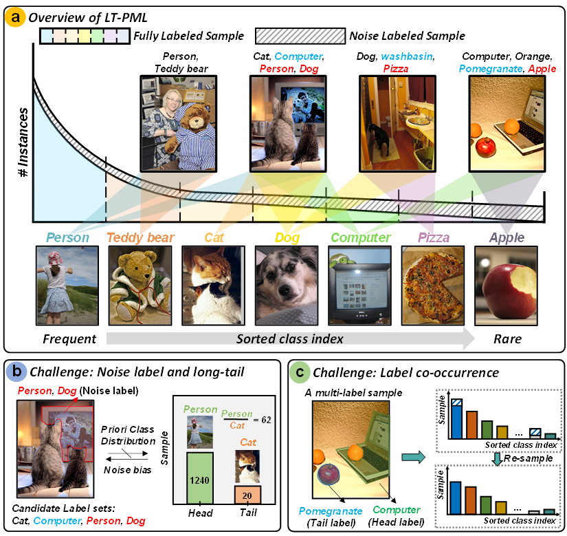

**Q1:** We will revise to "Two examples of PML images".

**Q2:** We will denote all sample variables at line 308 as $\boldsymbol{x}^i$ and harmonize the subsequent sample expressions.

**Q3:** Based on your comments, we will address this in the final version by (1) replacing $z(x,y)$ with $z(u,v)$ to avoid symbol conflicts; (2) explicitly defining "The feature projection $\boldsymbol{z}^i=G(\boldsymbol{v}^i) \in \mathbb{R} ^{D\times W\times H}$ is obtained from the projection network $G(\cdot)$, and $z^i(u,v)$ is the feature vectors of the location $(u,v)$ of the space size $W\times H$".

**Q4:** Insightful comment! We complement the comparison of running time and running memory in Table 1. We find that CoNeS' runtime is significantly lower than CPCL/TDRG and matches lightweight CSRA since **k-means clustering is executed only once at the beginning of each epoch (non-iterative execution)**. In addition, we find that memory usage is lower than ML-GCN/CPCL/TDRG and close to CSRA since **fixed-size FIFO memory bank preventing unbounded growth**.

*Table 1: For the resolution of 448, training time and running memory profiling with ResNet-101 backbone and RTX4090 GPU on VOC2007 with ρ=0.1 in one epoch.*
|Method|Training time (Sec)|Running memory (GB)|
|-|-|-|
|ML-GCN|85.86|11.97|
|SSGRL|51.50|5.32|
|CSRA|54.54|8.17|
|CPCL|105.89|12.02|
|TDRG|94.32|20.38|
|Our|80.18|8.95|

**Q5 and Q6:** We will revise Eq. (4) to $$c_{ij}=\frac{1}{K^2}\sum\nolimits_{\tilde{c}_k\in \mathcal{Q} _i}^{}{\sum\nolimits_{\tilde{c}_m\in \mathcal{Q} _j}^{}{\frac{\tilde{c}_k \cdot \tilde{c}_m}{\| \tilde{c}_k \| \| \tilde{c}_m \|}}},i,j\in L$$ in the final manuscript to improve clarity and avoid ambiguity.

**Q7:** Based on your comments, we acknowledge that $\tau$ requires dataset-specific tuning, which aligns with weakly-supervised learning (e.g., [46, 85]). Our design intentionally filters out misattributed features further through k-means - even if suboptimal $\tau$ allows partial noise into the feature set, k-means clustering will filter out the misattributed features. This preserves dominant feature patterns while diluting noise influence, as evidenced by <1% mAP fluctuation under $\tau$±0.2 perturbations in original Figure 9.  


# NDLP
#### Noise Correction and Distribution Fine-Tuning for Long-Tailed Partial Multi-Label Learning

  
  

## :video_camera: Problem description of LT-PML
In this paper, we present a new challenge for MLC on data setup called long-tailed partial multi-label learning (LT-PML), with both PML setup and LT distribution problems. As shown in the overview of LT-PML in Figure 1, LT-PML has the following two challenges: 1) `Mutual hindrance of noisy multi-label and long-tailed distributions`. First, the noisy candidate label sets prevent obtaining the class-wise label frequency priors, yet which is critical for existing LT methods. In addition, noisy labels are biased towards sparser tail classes due to ambiguity. This is because the classes that the labeler cannot accurately judge empirically after being misled by ambiguity often belong to infrequently labeled classes. The LT distribution skews the distribution, causing the model learning to be heavily biased towards the head class, which leads to the difficulty of label disambiguation (Figure 1(b)). 2) `Label co-occurrence`. Label co-occurrence is common in natural images. As shown in Figure 1(c), the rare label pomegranate appears in the same sample as the common label computer, which leads to the fact that resampling such an image does not necessarily improve the unbalanced class distribution and indirectly impairs the head class performance in training.


## :scroll: Abstract 
Long-tailed multi-label classification (LT-MLC) assumes that all samples are noise-free. The presence of label noise makes the prior class distribution unreliable. To address this problem, we introduce a new task, long-tailed partial multi-label learning (LT-PML), to consider noisy learning environments. LT-PML aims to generalize a classifier from long-tailed training samples, where each sample is associated with a set of candidate labels and only some of the labels are accurate. Not surprisingly, we find that the performance of most MLC and LT-MLC methods degrades significantly in the face of this task. Therefore, we propose a Noise correction and Distribution fine-tuning framework for LT-PML (NDLP). First, we estimate the confidence level of each label as the ground truth to mitigate the noisy label interference, and further use it to match the class distribution. In addition, we propose a noise correction method that uses prediction probabilities to re-weight classes to mitigate the negative contribution of the noisy labels to the positive samples. Finally, we develop a distributional fine-tuning to correct the estimation error due to label co-occurrence. The results indicate that NDLP significantly outperforms existing methods on LT-PML datasets with noise.


## :closed_book: Requirements 
* [Pytorch](https://pytorch.org/)
* [Sklearn](https://scikit-learn.org/stable/)
## :clipboard: Dataset 
To evaluate/train Long-Tailed Partial Multi-Label Learning, first, the [VOC2012/2007](http://host.robots.ox.ac.uk/pascal/VOC/) and [MSCOCO](https://cocodataset.org/#download) datasets need to be downloaded. The image paths, labels, and captions for the VOC-MLT and COCO-MLT datasets can be found [here]().

* [COCO-MLT](https://github.com/wutong16/DistributionBalancedLoss/tree/master/appendix/coco)
* [VOC-MLT](https://github.com/wutong16/DistributionBalancedLoss/tree/master/appendix/VOCdevkit)
```
Shell
├── appendix
    ├── coco
        ├── coco_lt_train.txt
        ├── coco_lt_test.txt
        ├── coco_labels.txt
        ├── longtail2017
            ├── class_freq.pkl
            ├── class_split.pkl
    ├── VOCdevkit
        ├── voc_lt_train.txt
        ├── voc_lt_test.txt
        ├── voc_labels.txt
        ├── longtail2012
            ├── class_freq.pkl
            ├── class_split.pkl
├── data
    ├── coco
        ├── train2017
            ├── 0000001.jpg
            ...
        ├── val2017
            ├── 0000002.jpg
            ...
    ├── voc
        ├── VOCdevkit
            ├── VOC2007
                ├── Annotations
                ├── ImageSets
                ├── JPEGImages
                    ├── 0000001.jpg
                    ...
                ├── SegementationClass
                ├── SegementationObject
            ├── VOC2012
                ├── Annotations
                ├── ImageSets
                ├── JPEGImages
                    ├── 0000002.jpg
                    ...
                ├── SegementationClass
                ├── SegementationObject
```
## :page_with_curl: Usage
### VOC-MLT
```bash
python lmpt/train.py configs/voc/LT_resnet50_pfc_DB.py \
--dataset 'voc-lt' \
--seed '0' \
--batch_size 32 \
--epochs 10 \
--gamma 3
--partial_rate 0.3/0.5 \
--eta 0.9 \
--alpha_range 0.4,0.8 \
```
### COCO-MLT
```bash
python lmpt/train.py configs/coco/LT_resnet50_pfc_DB.py \ 
--dataset 'voc-lt' \
--seed '0' \
--batch_size 32 \
--epochs 10 \
--gamma 2
--partial_rate 0.05/0.1 \
--eta 0.9 \
--alpha_range 0.4,0.8 \
```
## :wrench: Pre-trained models
#### COCO-MLT
|   Backbone  | $$\rho$$  |    Total   |    Head   |  Medium  |   Tail  |      Download      |
| :---------: |:---------:| :------------: | :-----------: | :---------: | :---------: | :----------------: |
|  ResNet-50  |    0.05   |    40.06   |    41.87  |  40.57   | 37.80   | [model](https://drive.google.com/drive/folders/1ju2zTv6pOuso8wBixN4RqLtszU8d8WDk?hl=zh-cn)   |
|  ResNet-50  |    0.1    |    35.21   |    40.65  |  32.83   | 33.55   | [model](https://drive.google.com/drive/folders/1ju2zTv6pOuso8wBixN4RqLtszU8d8WDk?hl=zh-cn)   |

#### VOC-MLT
|   Backbone  | $$\rho$$  |    Total   |    Head   |  Medium  |   Tail  |      Download      |
| :---------: |:---------:| :------------: | :-----------: | :---------: | :---------: | :----------------: |
|  ResNet-50  |    0.3    |    59.51   |    59.54  |  70.33   | 51.38   | [model](https://drive.google.com/drive/folders/1ju2zTv6pOuso8wBixN4RqLtszU8d8WDk?hl=zh-cn)   |
|  ResNet-50  |    0.5    |    40.76   |    43.09  |  52.59   | 30.13   | [model](https://drive.google.com/drive/folders/1ju2zTv6pOuso8wBixN4RqLtszU8d8WDk?hl=zh-cn)   |
## :heartpulse: Acknowledgements
We use code from [DBL](https://github.com/wutong16/DistributionBalancedLoss) and [LMPT](https://github.com/richard-peng-xia/LMPT). We thank the authors for releasing their code.
## :mailbox_closed: Contact
If you have any questions, please create an issue on this repository or contact at [23171214508@stu.xidian.edu.cn](mailto:23171214508@stu.xidian.edu.cn).
<!-- ## :pencil2: Citing
If you find this code useful, please consider to cite our work.
```
``` -->

